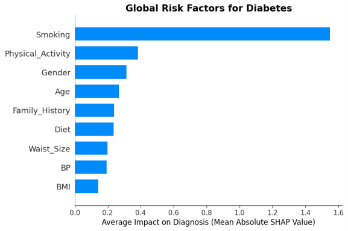
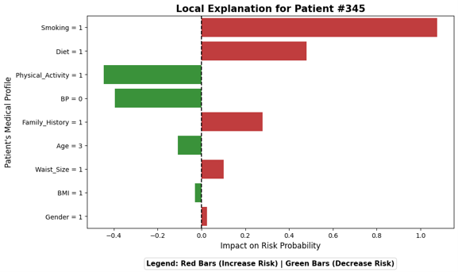

<div align="center">

  <h1>Early Prediction of Diabetes Risk Using Explainable AI (XAI)</h1>

  <p align="center">
    <a href="https://www.python.org/"></a>
    <a href="https://colab.research.google.com/"></a>
    <a href="https://xgboost.readthedocs.io/"></a>
    <a href="https://shap.readthedocs.io/"></a>
    <a href="https://www.vision2030.gov.sa/"></a>
    
  </p>

  <p style="color: #c9d1d9; font-size: 1.1em; line-height: 1.6; margin-top: 15px;">
    A secure, cloud-based predictive framework utilizing Explainable Artificial Intelligence (XAI) to provide highly sensitive, transparent, and clinically safe early diabetes risk assessments via a <b>Clinically Biased XGBoost Engine</b>.
  </p>

  <p align="center">
    <a href="https://github.com/Fahad-Mutlaq/XAI-Diabetes-Prediction/blob/main/docs/XAI-Diabetes-Prediction-Report.pdf" target="_blank">
      
    </a>
    <a href="https://github.com/Fahad-Mutlaq/XAI-Diabetes-Prediction/raw/main/docs/XAI-Diabetes-Prediction-Report.pdf">
      
    </a>
  </p>

</div>

---

## Project Overview
This repository contains the complete implementation and documentation for an advanced predictive analytics framework designed for early diabetes screening. Developed as a graduation project at Qassim University, the framework shifts away from traditional "black-box" machine learning by weaving mathematical interpretability directly into the clinical core, allowing medical professionals to audit, trust, and act upon automated risk assessments.

### Core Capabilities
* **Clinical Safety First:** Engineered with a heavily optimized classification threshold (0.295) achieving an exceptional **96.41% Recall (Sensitivity)** to prioritize patient safety and minimize missed diagnoses.
* **Transparent Diagnostics:** Integrated SHAP (SHapley Additive exPlanations) to dismantle complex algorithmic outputs into human-readable medical justifications.
* **Cloud-Native Development:** Fully trained, audited, and optimized securely within automated cloud-compute pipelines.
* **Preventative Healthcare:** Tailored to align with the proactive digital healthcare objectives of Saudi Vision 2030.

---

## Repository Structure
The project is structured according to enterprise-grade layout principles to separate source code, documentation, and asset files:

* `data/` — Contains the sanitized, pre-balanced cross-sectional survey dataset utilized for training.
* `docs/` — Contains the comprehensive, publication-ready project report (`XAI-Diabetes-Prediction-Report.pdf`).
* `assets/images/` — Holds all high-resolution visual documentation, pipelines, and SHAP output plots.
* `main.py` — The core analytical pipeline script containing data ingestion, XGBoost optimization, and SHAP execution.
* `requirements.txt` — Explicit environment dependencies definition file.

---

## Cloud Infrastructure & Security Focus (CIA Triad)
As an Information Technology initiative, handling sensitive public health information demanded strict compliance with modern cybersecurity and secure development practices during data parsing and processing phases:

* **Data Confidentiality & Anonymization:** Prior to ingestion, data was sanitized through programmatically dropping unneeded geographic fields (e.g., 'Region'). This strictly mitigated location-based inference attacks and demographic profiling, safeguarding baseline user privacy.
* **Integrity & Algorithmic Auditing:** The integration of the SHAP framework serves an essential technical auditing purpose. By tracking the exact global attribution of features, we actively verified that the model did not absorb "Data Poisoning" artifacts or skewed historical sampling anomalies (such as technical sampling paradoxes with physical activity indices).
* **Environment Isolation:** Model execution was handled inside compartmentalized, secure cloud runtimes, abstracting library versions (`xgboost`, `shap`, `scikit-learn`) away from host machine vulnerabilities while ensuring immutable state tracking.

---

## System Architecture
The framework follows a modular pipeline that ingests features, processes data under a cost-sensitive matrix, and maps results to a dual-layered explainability engine.

<div align="center">
  
  <br>
  <i>Figure 1: Comprehensive Data Processing, Cloud-Modeling, and Validation Layer Architecture.</i>
</div>

---

## Predictive Performance & Clinical Validation
Standard machine learning configurations balance total accuracy (0.50 default threshold), which can lead to high rates of hazardous False Negatives in medical settings. This framework deliberately optimizes for maximum clinical coverage:

| Metric | Score | Clinical / Operational Significance |
| :--- | :--- | :--- |
| **Recall (Sensitivity)** | **96.41%** | Catches nearly every high-risk patient, reducing missed clinical cases to a bare minimum (FN = 1.8%). |
| **AUC-ROC Score** | **88.21%** | Outstanding statistical ability to separate true diabetic risk factors from healthy baselines. |
| **F1-Score** | **83.62%** | Demonstrates rigorous algorithmic stability across balanced feature sets. |
| **Overall Accuracy** | **81.13%** | Acceptable structural trade-off deliberately accepted to unlock ultra-high Recall performance. |

---

## Explainable AI (XAI) Output Reports
The system automatically maps mathematical data distributions into distinct, clinical-grade interpretation panels:

<div align="center">
  <table width="100%" style="border-collapse: collapse; border: none;">
    <tr>
      <td width="50%" align="center" style="padding: 10px; border: none; vertical-align: top;">
        <a href="assets/images/global-shap-summary.png" target="_blank">
          
        </a>
        <br><br><b>Global Risk Factors (Population Level)</b><br>
        <span style="color: #8b949e; font-size: 0.9em;"><i>Identifies and ranks the leading clinical risk vectors (e.g., Smoking, Inactivity) across the aggregate population.</i></span>
      </td>
      <td width="50%" align="center" style="padding: 10px; border: none; vertical-align: top;">
        <a href="assets/images/local-shap-patient-345.png" target="_blank">
          
        </a>
        <br><br><b>Local Patient Diagnostics (Individual Level)</b><br>
        <span style="color: #8b949e; font-size: 0.9em;"><i>Provides a personalized "second-opinion" vector for Patient #345. Red bars denote expanding risk indicators; Green indicates protective attributes.</i></span>
      </td>
    </tr>
  </table>
</div>

---

## Engineering Challenges & Strategic Solutions
* **The "Black Box" Dilemma:** Advanced ensemble networks do not inherently provide an explanation path, impeding regulatory clinical deployment. <br><b>Solution:</b> Bound a dedicated `TreeExplainer` directly to the model structure, computing exact Shapley values to fulfill strict transparency demands.
* **Class Imbalance Realities:** Public health data contains overwhelming majorities of non-diabetic reports. <br><b>Solution:</b> Passed cost-sensitive vectors (`scale_pos_weight = 1.3`) natively inside the training configuration to heavily penalize missed diagnoses without adding synthetic distortion.
* **Operational Thresholding:** Standard 0.5 cuts misclassified high-risk diabetic patients due to variance. <br><b>Solution:</b> Executed exhaustive Precision-Recall step optimization, overriding baseline configs to hardcode a targeted `0.295` clinical threshold.

---

## Getting Started (Deployment & Verification)

### Prerequisites
* **Environment:** Google Colab, Jupyter Notebook, or a localized Python IDE.
* **Core Language:** Python 3.x
* **Required Environments:** Libraries listed directly within `requirements.txt`.

### Execution Pipeline
1. Clone the project environment structure to your workspace:
    ```bash
    git clone [https://github.com/Fahad-Mutlaq/XAI-Diabetes-Prediction.git](https://github.com/Fahad-Mutlaq/XAI-Diabetes-Prediction.git)
    cd XAI-Diabetes-Prediction
    ```

2. Instantly install explicit library versions:
    ```bash
    pip install -r requirements.txt
    ```

3. Run the primary modeling script or step-by-step notebook structure to evaluate metrics and re-generate local/global SHAP plots:
    ```bash
    python main.py
    ```

---

## Future Roadmap (Scalability & Cloud Evolution)
To bridge the gap between academic prototyping and enterprise hospital integration:
1. **Containerized API Gateway Deployment:** Wrapping the python pipeline inside a secure **Docker container** and scaling it via an **AWS API Gateway** or Azure endpoints utilizing modern TLS 1.3 encryption.
2. **Real-time EHR Ingestion:** Linking model components directly to Electronic Health Record (EHR) database streams via specialized, IAM-controlled private ingestion adapters.
3. **Optimized Edge Inferencing:** Compiling the finalized XGBoost structure via TensorRT/ONNX runtimes to perform locally on air-gapped **hospital edge devices**, preventing critical patient leakage across open public connections.

---

## Project Team & Academic Context
Developed at **Qassim University** (Department of Information Technology)  
**Final Grade:** A+

### IT Engineering Team
* **[Fahad Alharbi](https://www.linkedin.com/in/fahad-mu-alharbi)**
* **Abdulmajeed Abalkhail**
* **Abdullah Altuwaijri**
* **Abdulmohsen Aleid**

### Academic Supervision
* **Dr. Manal Alghaith**

---

## License
This project is formulated purely for academic research, validation, and educational portfolio application. Always ensure stringent compliance with global medical guidelines and statutory data acts (e.g., HIPAA) before managing live public patient analytics.

---

## Let's Connect
Whether you're interested in collaborating, have questions about the secure ML pipelines, or want to discuss innovative IT healthcare solutions—feel free to reach out directly!

<p align="left">
  <a href="mailto:fahad.alharbi7@outlook.com"></a>
  <a href="https://www.linkedin.com/in/fahad-mu-alharbi"></a>
</p>
